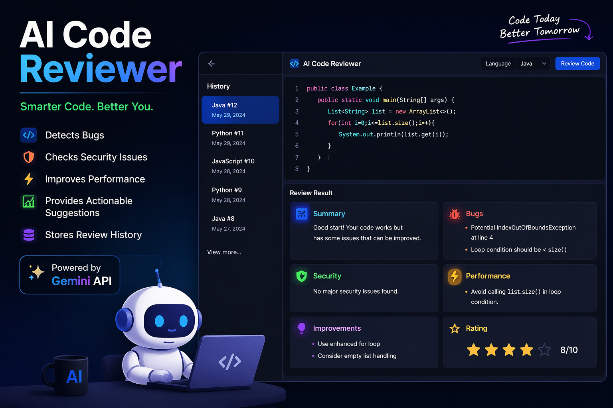

# 🚀 AI Code Reviewer 

  

An AI-powered full-stack application that analyzes code for bugs, security issues, performance problems, and improvements using Google Gemini API.

---

## ✨ Features

- 🔍 Detects bugs and edge cases
- 🔐 Identifies security vulnerabilities
- ⚡ Highlights performance issues
- 💡 Suggests improvements
- 📊 Provides structured feedback (Summary, Bugs, Security, Performance, Improvements, Rating)
- 🧠 Supports multiple languages (Java, Python, JavaScript, etc.)
- 🕘 Stores review history using Hibernate JPA
- 🖥️ Interactive UI with Monaco Editor

---

## 🏗️ Tech Stack

| Layer      | Technology |
|-----------|-----------|
| Backend   | Java 17, Spring Boot |
| ORM       | Hibernate JPA |
| Database  | MySQL |
| AI        | Google Gemini API |
| Frontend  | HTML, CSS, JavaScript |
| Editor    | Monaco Editor |

---

## ⚙️ Setup Instructions

### 1️⃣ Clone the repository
git clone https://github.com/YOUR-USERNAME/YOUR-REPO.git 
cd YOUR-REPO

### 2️⃣ Configure database

Create MySQL database:

CREATE DATABASE codereview;

### 3️⃣ Update application.properties
spring.datasource.url=jdbc:mysql://localhost:3306/codereview 
spring.datasource.username=YOUR_USERNAME 
spring.datasource.password=YOUR_PASSWORD

spring.jpa.hibernate.ddl-auto=update

gemini.api.key=YOUR_API_KEY 
gemini.api.url=https://generativelanguage.googleapis.com/v1beta/models/gemini-2.0-flash:generateContent

### 4️⃣ Run the application
mvn spring-boot:run

### 5️⃣ Open in browser
http://localhost:8080 

🧠 How it works 
User enters code in the editor 
Request is sent to Spring Boot backend 
Backend calls Gemini API 
AI analyzes code and returns structured response 
Result is displayed and stored in database

📁 Project Structure 
src/main/java/com/codereview/ 
├── controller/       # REST + UI controllers 
├── service/          # Business logic + AI integration 
├── repository/       # JPA repositories 
├── model/            # Entity classes 
├── dto/              # Data transfer objects 
├── config/           # Configuration classes 

🚧 Future Improvements
🔐 Authentication (JWT) 
📊 Code quality score visualization 
🎯 Beginner vs Expert feedback mode 
📄 Export reports (PDF) 
☁️ Cloud deployment 

🤝 Contributing 
Contributions are welcome! Feel free to fork and improve.

📬 Contact 
If you have feedback or suggestions, feel free to connect! 
gmail: divyasonawane378@gmail.com 
linkedin: https://www.linkedin.com/in/divya-sonawane1/ 

⭐ If you like this project 
Give it a star ⭐ on GitHub! 

